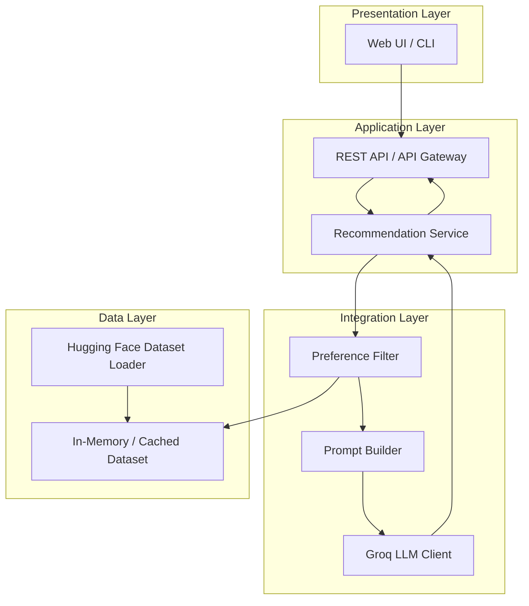
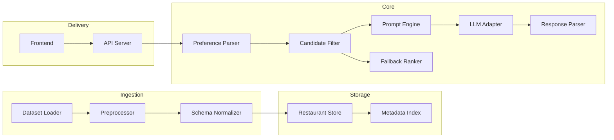
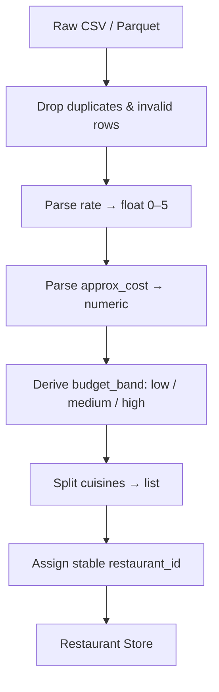
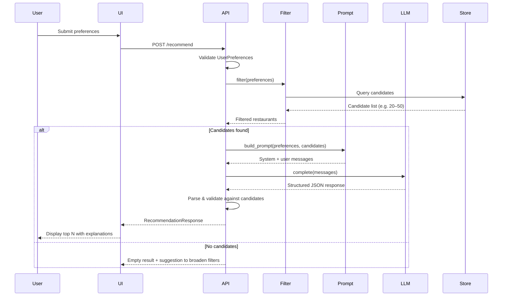
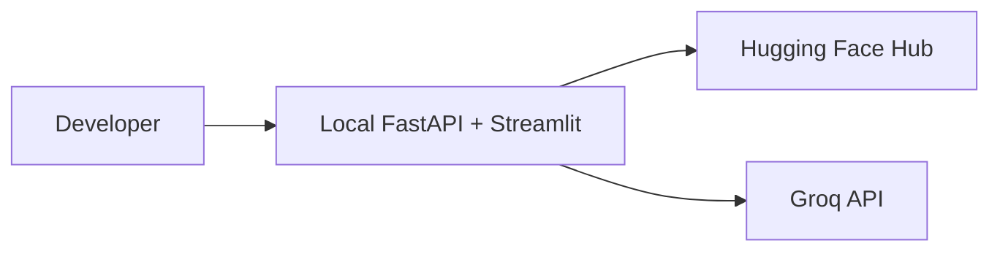
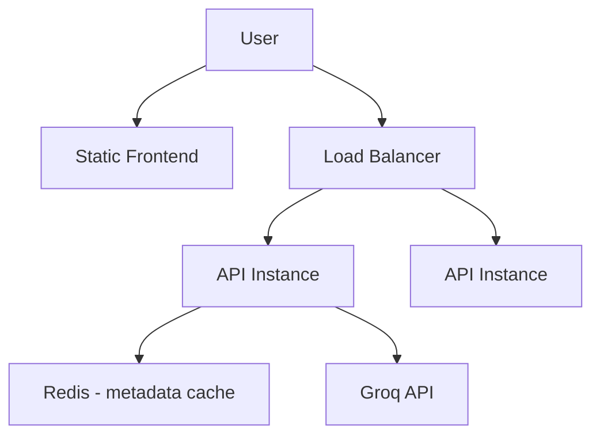

# Architecture: AI-Powered Restaurant Recommendation System

This document describes the system architecture for the Zomato-inspired restaurant recommendation service defined in [context.md](context.md). The design combines structured restaurant data with **Groq**-hosted LLM inference to produce personalized, explainable recommendations.

---

## Table of Contents

1. [Architecture Overview](#1-architecture-overview)
2. [Design Principles](#2-design-principles)
3. [System Components](#3-system-components)
4. [Data Architecture](#4-data-architecture)
5. [Request Flow](#5-request-flow)
6. [Component Deep Dive](#6-component-deep-dive)
7. [LLM Integration](#7-llm-integration)
8. [API Design](#8-api-design)
9. [Data Models](#9-data-models)
10. [Technology Stack](#10-technology-stack)
11. [Deployment Architecture](#11-deployment-architecture)
12. [Non-Functional Requirements](#12-non-functional-requirements)
13. [Security & Privacy](#13-security--privacy)
14. [Future Extensions](#14-future-extensions)

---

## 1. Architecture Overview

The system follows a **layered pipeline architecture** with a clear separation between data ingestion, preference filtering, LLM reasoning, and presentation.



### High-Level Responsibilities

| Layer | Responsibility |
|-------|----------------|
| **Presentation** | Collect user preferences; display ranked recommendations with explanations |
| **Application** | Orchestrate requests; validate input; shape responses |
| **Integration** | Filter candidates; build LLM prompts; parse structured LLM output |
| **Data** | Load, preprocess, and serve restaurant records |

---

## 2. Design Principles

1. **Filter before reason** — Apply deterministic filters (location, cuisine, budget, rating) to reduce the candidate set before sending data to the LLM. This lowers token cost, improves latency, and keeps recommendations grounded in real data.

2. **Structured output from LLM** — Require the LLM to return JSON (or a parseable schema) with ranks, restaurant identifiers, and explanations. Avoid free-form-only responses that are hard to display reliably.

3. **Grounded recommendations** — The LLM must only recommend restaurants present in the filtered candidate list. Prompt design and post-validation enforce this constraint.

4. **Separation of concerns** — Data loading, filtering, prompting, and UI are independent modules with well-defined interfaces.

5. **Graceful degradation** — If the LLM is unavailable, fall back to rule-based ranking (e.g., sort by rating and votes) so the app remains usable.

---

## 3. System Components

### 3.1 Component Map



### 3.2 Component Descriptions

| Component | Description |
|-----------|-------------|
| **Dataset Loader** | Fetches `ManikaSaini/zomato-restaurant-recommendation` from Hugging Face via `datasets` library |
| **Preprocessor** | Cleans ratings, normalizes cost, handles nulls, deduplicates |
| **Schema Normalizer** | Maps raw columns to internal `Restaurant` model |
| **Restaurant Store** | In-memory DataFrame or lightweight DB for fast filtering |
| **Metadata Index** | Precomputed lists of locations, cuisines, cost bands for UI dropdowns |
| **Preference Parser** | Validates and normalizes user input into `UserPreferences` |
| **Candidate Filter** | SQL-like or pandas filtering on structured fields |
| **Prompt Engine** | Assembles system + user prompts with candidate context |
| **LLM Adapter** | Groq API client behind a typed interface for ranking and explanations |
| **Response Parser** | Validates LLM JSON; maps IDs back to full restaurant records |
| **Fallback Ranker** | Rule-based ranking when LLM fails or times out |
| **API Server** | Exposes `/recommend`, `/locations`, `/cuisines` endpoints |
| **Frontend** | Form for preferences + results cards |

---

## 4. Data Architecture

### 4.1 Source Dataset

| Attribute | Value |
|-----------|-------|
| **Source** | [ManikaSaini/zomato-restaurant-recommendation](https://huggingface.co/datasets/ManikaSaini/zomato-restaurant-recommendation) |
| **Rows** | ~51,717 |
| **Size** | ~574 MB |
| **Primary geography** | Bangalore (with neighbourhood-level locations) |

### 4.2 Raw Schema (17 columns)

| Column | Type | Usage in System |
|--------|------|-----------------|
| `name` | string | Display; LLM context |
| `location` | string | User filter (neighbourhood) |
| `listed_in(city)` | string | User filter (city/area) |
| `cuisines` | string (comma-separated) | User filter; display |
| `rate` | string (e.g. `"4.1/5"`) | Filter + display; requires parsing |
| `approx_cost(for two people)` | string | Budget mapping; display |
| `votes` | int | Fallback ranking signal |
| `rest_type` | string | Additional preference (e.g. casual dining) |
| `online_order` | string (Yes/No) | Optional filter |
| `book_table` | string (Yes/No) | Optional filter |
| `dish_liked` | string | LLM context for personalization |
| `reviews_list` | string | Optional LLM context (truncated) |
| `menu_item` | string | Optional LLM context |
| `listed_in(type)` | string | Meal type filter (buffet, cafes, etc.) |
| `address` | string | Display |
| `phone` | string | Display (optional) |
| `url` | string | Link to Zomato page |

### 4.3 Preprocessing Pipeline



**Preprocessing rules:**

- **Rating**: Strip `/5`, convert to float; drop or flag rows with missing/invalid ratings when `min_rating` is set.
- **Cost**: Parse `approx_cost(for two people)` to integer; map to bands:
  - **Low**: ≤ ₹300
  - **Medium**: ₹301–₹600
  - **High**: > ₹600
  (Thresholds configurable per city.)
- **Cuisines**: Lowercase, trim, split on comma for substring matching.
- **Reviews**: Truncate to N characters per restaurant when included in LLM context.

### 4.4 Internal Restaurant Model

```python
Restaurant:
    id: str                    # stable hash or row index
    name: str
    location: str
    city: str                  # from listed_in(city)
    cuisines: list[str]
    rating: float              # 0.0 – 5.0
    votes: int
    cost_for_two: int          # INR
    budget_band: str           # low | medium | high
    rest_type: str
    meal_type: str             # from listed_in(type)
    online_order: bool
    book_table: bool
    dish_liked: str | None
    address: str
    url: str | None
```

---

## 5. Request Flow

### 5.1 End-to-End Sequence



### 5.2 Filtering Logic

Filters are applied in order; each step narrows the candidate set:

1. **Location** — Match `location` or `listed_in(city)` (case-insensitive).
2. **Cuisine** — Any selected cuisine appears in `cuisines` list.
3. **Minimum rating** — `rating >= min_rating`.
4. **Budget** — `budget_band` matches user selection.
5. **Additional preferences** (optional):
   - `online_order == true` if user wants delivery
   - `book_table == true` if user wants table booking
   - `rest_type` or `meal_type` keyword match for "family-friendly", "quick bites", etc.

**Candidate cap**: If more than `MAX_CANDIDATES` (e.g. 30) match, pre-rank by `(rating, votes)` and pass top K to the LLM.

---

## 6. Component Deep Dive

### 6.1 Data Ingestion Module

**Responsibilities:**
- Download dataset on first run (or load from local cache).
- Run preprocessing pipeline.
- Build metadata indexes for UI autocomplete.

**Interface:**

```python
class DataLoader:
    def load(force_refresh: bool = False) -> pd.DataFrame
    def get_locations() -> list[str]
    def get_cuisines() -> list[str]
    def get_restaurant_store() -> RestaurantStore
```

**Caching strategy:**
- Cache processed parquet locally (`data/processed/restaurants.parquet`).
- Refresh only when cache missing or `force_refresh=True`.

### 6.2 Preference Filter Module

**Responsibilities:**
- Accept `UserPreferences` and return matching `Restaurant` list.
- Enforce business rules (e.g. min 1 candidate or return empty with reason).

**Interface:**

```python
class CandidateFilter:
    def filter(
        preferences: UserPreferences,
        store: RestaurantStore,
        max_candidates: int = 30
    ) -> list[Restaurant]
```

### 6.3 Recommendation Service (Orchestrator)

Central coordinator that:
1. Invokes filter.
2. Builds prompt.
3. Calls LLM adapter.
4. Parses response.
5. Falls back to `FallbackRanker` on LLM error.

```python
class RecommendationService:
    def recommend(preferences: UserPreferences) -> RecommendationResponse
```

### 6.4 Presentation Layer

**Web UI (recommended):**
- **Input form**: dropdowns for location, budget, cuisine; slider for min rating; text field for free-form preferences.
- **Results view**: cards showing name, cuisine, rating, cost, explanation; optional summary paragraph.
- **Empty state**: suggest relaxing filters.

**Alternative**: CLI or Jupyter notebook for prototyping.

---

## 7. LLM Integration

**Provider:** [Groq](https://groq.com/) — all LLM calls in this project use the Groq API for fast inference on open models (e.g. Llama 3.3).

### 7.1 LLM Role

The LLM is **not** the source of restaurant data. It acts as a **reasoning and explanation layer** over a pre-filtered, structured candidate set.

| Task | LLM Responsibility |
|------|-------------------|
| Ranking | Order candidates by fit to stated and implied preferences |
| Explanation | Per-restaurant rationale in natural language |
| Summary | Optional overview of the recommendation set |

### 7.2 Prompt Structure

**System prompt** (stable):
- Role: restaurant recommendation assistant for Bangalore Zomato data.
- Constraints: only recommend from provided list; return valid JSON; cite specific preference matches.
- Output schema definition.

**User prompt** (per request):
- Serialized `UserPreferences`.
- Numbered list of candidates with key fields (id, name, cuisines, rating, cost, rest_type, dish_liked snippet).
- Instruction: return top 5 with ranks and explanations.

### 7.3 Expected LLM Output Schema

```json
{
  "summary": "Based on your preference for Italian food in Koramangala with a medium budget...",
  "recommendations": [
    {
      "restaurant_id": "abc123",
      "rank": 1,
      "explanation": "Matches your Italian cuisine preference, rated 4.5/5, and fits your medium budget at ~₹500 for two."
    }
  ]
}
```

### 7.4 Post-LLM Validation

1. Parse JSON; retry once with repair prompt on failure.
2. Verify every `restaurant_id` exists in the candidate set.
3. Reject hallucinated restaurants.
4. Merge LLM output with full `Restaurant` records for API response.
5. If validation fails entirely → `FallbackRanker`.

### 7.5 Groq LLM Client

The application uses the **Groq Python SDK** (`groq`) to call Groq's hosted inference API. An internal `LLMClient` protocol wraps the SDK so recommendation logic stays decoupled from HTTP details.

```python
class LLMClient(Protocol):
    def complete(
        messages: list[Message],
        response_format: dict | None = None,
        temperature: float = 0.3
    ) -> str
```

**Groq implementation** (via `GroqLLMClient`):

```python
from groq import Groq

client = Groq(api_key=settings.GROQ_API_KEY)
response = client.chat.completions.create(
    model=settings.GROQ_MODEL,
    messages=messages,
    temperature=temperature,
    response_format={"type": "json_object"},  # when structured output required
)
```

**Recommended models:**
- `llama-3.3-70b-versatile` — default for ranking and explanations (quality + speed)
- `llama-3.1-8b-instant` — optional fallback for lower latency / cost

**Configuration** (environment variables):
- `GROQ_API_KEY` — Groq API key (required)
- `GROQ_MODEL` — model ID (default: `llama-3.3-70b-versatile`)
- `GROQ_TIMEOUT_SECONDS` — request timeout (e.g. 30)
- `GROQ_MAX_TOKENS` — max completion tokens

### 7.6 Token Budget Management

| Strategy | Implementation |
|----------|----------------|
| Limit candidates | Max 30 restaurants in prompt |
| Truncate long fields | `dish_liked`, `reviews_list` capped at 100 chars |
| Compact serialization | Table or bullet list, not full JSON per row |
| Caching | Cache metadata indexes; do not re-send static system context if provider supports prompt caching |

---

## 8. API Design

### 8.1 Endpoints

| Method | Path | Description |
|--------|------|-------------|
| `GET` | `/health` | Health check |
| `GET` | `/metadata/locations` | List available locations |
| `GET` | `/metadata/cuisines` | List available cuisines |
| `GET` | `/metadata/budget-bands` | Return budget band definitions |
| `POST` | `/recommend` | Generate recommendations |

### 8.2 `POST /recommend`

**Request body:**

```json
{
  "location": "Koramangala",
  "budget": "medium",
  "cuisine": "Italian",
  "min_rating": 4.0,
  "additional_preferences": "family-friendly, good for dinner",
  "top_n": 5
}
```

**Response body:**

```json
{
  "summary": "Here are the top Italian restaurants in Koramangala...",
  "recommendations": [
    {
      "rank": 1,
      "restaurant": {
        "id": "abc123",
        "name": "Truffles",
        "cuisines": ["Italian", "American"],
        "rating": 4.5,
        "cost_for_two": 500,
        "budget_band": "medium",
        "location": "Koramangala",
        "address": "...",
        "url": "https://www.zomato.com/..."
      },
      "explanation": "Highly rated Italian option that fits your medium budget..."
    }
  ],
  "meta": {
    "candidates_considered": 12,
    "source": "llm",
    "model": "llama-3.3-70b-versatile"
  }
}
```

**Error responses:**

| Status | Condition |
|--------|-----------|
| `400` | Invalid preferences (missing location, invalid budget) |
| `404` | No restaurants match filters |
| `503` | LLM unavailable and fallback disabled |
| `500` | Internal error |

---

## 9. Data Models

### 9.1 UserPreferences

```python
UserPreferences:
    location: str                           # required
    budget: Literal["low", "medium", "high"]# required
    cuisine: str                            # required
    min_rating: float = 0.0                 # 0.0 – 5.0
    additional_preferences: str | None = None # free text for LLM
    top_n: int = 5                          # 1 – 10
```

### 9.2 Recommendation (API response item)

```python
Recommendation:
    rank: int
    restaurant: Restaurant
    explanation: str
```

### 9.3 RecommendationResponse

```python
RecommendationResponse:
    summary: str | None
    recommendations: list[Recommendation]
    meta: ResponseMeta
```

---

## 10. Technology Stack

### 10.1 Recommended Stack

| Layer | Technology | Rationale |
|-------|------------|-----------|
| **Language** | Python 3.11+ | Rich ML/data ecosystem; Hugging Face `datasets` |
| **Data** | `pandas`, `datasets` | Dataset loading and filtering |
| **API** | FastAPI | Async, automatic OpenAPI docs, Pydantic validation |
| **LLM** | Groq (`groq` SDK) | Fast inference; Llama models for ranking and explanations |
| **Frontend** | React + Vite or Streamlit | Streamlit for fast MVP; React for production UI |
| **Config** | `pydantic-settings`, `.env` | Environment-based secrets |
| **Testing** | `pytest` | Unit tests for filter, parser, fallback ranker |

### 10.2 Project Structure

```
zomato-recommendation/
├── app/
│   ├── main.py                 # FastAPI app entry
│   ├── api/
│   │   ├── routes/
│   │   │   ├── recommend.py
│   │   │   └── metadata.py
│   │   └── dependencies.py
│   ├── core/
│   │   ├── config.py
│   │   └── exceptions.py
│   ├── models/
│   │   ├── restaurant.py
│   │   ├── preferences.py
│   │   └── recommendation.py
│   ├── services/
│   │   ├── data_loader.py
│   │   ├── filter.py
│   │   ├── recommendation.py
│   │   ├── fallback_ranker.py
│   │   └── prompt_builder.py
│   ├── llm/
│   │   ├── groq_client.py      # Groq SDK wrapper
│   │   ├── parser.py
│   │   └── prompts.py
│   └── data/
│       └── preprocessor.py
├── frontend/                   # optional React or Streamlit app
├── data/
│   └── processed/              # cached parquet
├── tests/
├── .env.example
├── requirements.txt
├── context.md
└── architecture.md
```

---

## 11. Deployment Architecture

### 11.1 Development



- Dataset cached locally after first download.
- `GROQ_API_KEY` in `.env` (never committed).

### 11.2 Production (optional)



| Concern | Approach |
|---------|----------|
| **Dataset** | Preprocessed at build/deploy; baked into container or mounted volume |
| **Scaling** | Stateless API replicas; shared nothing |
| **Groq rate limits** | Request queuing; exponential backoff per Groq tier limits |
| **Monitoring** | Log latency, filter hit rate, LLM errors, token usage |

---

## 12. Non-Functional Requirements

| Requirement | Target |
|-------------|--------|
| **Latency (p95)** | < 5s including Groq inference (Groq typically sub-second for ranking prompts) |
| **Filter-only path** | < 200ms (fallback mode) |
| **Availability** | Degrade to rule-based ranking if LLM down |
| **Data freshness** | Manual dataset refresh; no live Zomato API |
| **Concurrency** | 10+ concurrent users (single instance, MVP) |
| **Maintainability** | Modular services; typed models; API docs via OpenAPI |

---

## 13. Security & Privacy

| Area | Measure |
|------|---------|
| **API keys** | `GROQ_API_KEY` in environment variables; never in code or logs |
| **User input** | Sanitize free-text preferences; limit length (e.g. 500 chars) |
| **Output** | Do not expose raw `reviews_list` in API by default (PII risk) |
| **Rate limiting** | Apply per-IP limits on `/recommend` in production |
| **HTTPS** | Terminate TLS at load balancer |

---

## 14. Future Extensions

1. **Multi-city expansion** — Extend beyond Bangalore when additional datasets are available.
2. **Semantic search** — Embed `dish_liked` and reviews; hybrid filter + vector retrieval before LLM.
3. **User sessions** — Remember past preferences and dining history.
4. **Feedback loop** — Thumbs up/down on recommendations to tune prompts.
5. **Streaming explanations** — Stream LLM summary token-by-token in UI.
6. **Comparison mode** — Side-by-side comparison of two recommended restaurants.
7. **Map view** — Geocode addresses and show recommendations on a map.

---

## Appendix: Mapping to Context Workflow

| Context workflow step | Architecture component |
|-----------------------|------------------------|
| Data Ingestion | `DataLoader`, `Preprocessor`, `RestaurantStore` |
| User Input | Frontend form → `UserPreferences` |
| Integration Layer | `CandidateFilter`, `PromptBuilder` |
| Recommendation Engine | `RecommendationService`, `GroqLLMClient`, `FallbackRanker` |
| Output Display | API `RecommendationResponse` → Frontend cards |

---

*This architecture aligns with [context.md](context.md) and is intended to guide implementation of the AI-powered Zomato restaurant recommendation system.*
