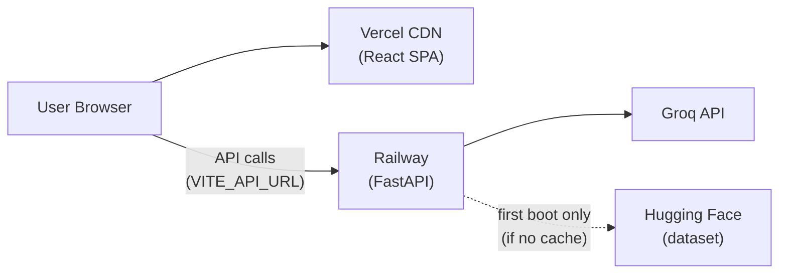
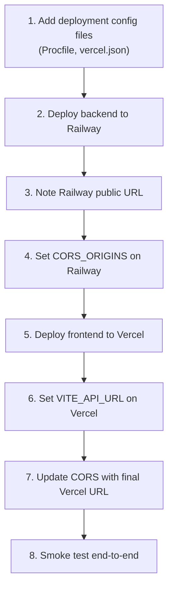

# Deployment Plan: DineAI Restaurant Recommender

This document describes how to deploy the **Zomato-inspired AI restaurant recommendation system** to production using:

| Component | Platform | Role |
|-----------|----------|------|
| **Backend API** (FastAPI) | [Railway](https://railway.app) | REST API, dataset, Groq LLM |
| **Frontend** (React + Vite) | [Vercel](https://vercel.com) | Static SPA (DineAI UI) |

Repository: [github.com/NikhilKRaj/zomato-recommender0](https://github.com/NikhilKRaj/zomato-recommender0)

Derived from [implementation-plan.md](implementation-plan.md) Phase 9 and [architecture.md](architecture.md) §11.

---

## Table of Contents

1. [Architecture Overview](#1-architecture-overview)
2. [Prerequisites](#2-prerequisites)
3. [Deployment Order](#3-deployment-order)
4. [Backend — Railway](#4-backend--railway)
5. [Frontend — Vercel](#5-frontend--vercel)
6. [Environment Variables](#6-environment-variables)
7. [CORS Configuration](#7-cors-configuration)
8. [Dataset Strategy](#8-dataset-strategy)
9. [Required Repo Additions](#9-required-repo-additions)
10. [Post-Deploy Verification](#10-post-deploy-verification)
11. [CI/CD (Optional)](#11-cicd-optional)
12. [Monitoring & Operations](#12-monitoring--operations)
13. [Cost & Limits](#13-cost--limits)
14. [Troubleshooting](#14-troubleshooting)
15. [Rollback](#15-rollback)

---

## 1. Architecture Overview



### Request flow (production)

1. User opens the Vercel-hosted SPA.
2. Browser fetches metadata and posts recommendations to the Railway API URL (`VITE_API_URL`).
3. Railway filters restaurants from the in-memory dataset, calls Groq for ranking/explanations, returns JSON.
4. Vercel serves only static assets — it does **not** proxy API requests in production (unlike local Vite dev proxy).

---

## 2. Prerequisites

| Item | Notes |
|------|-------|
| **GitHub repo** | Code pushed to `main` |
| **Railway account** | [railway.app](https://railway.app) — connect GitHub |
| **Vercel account** | [vercel.com](https://vercel.com) — connect GitHub |
| **Groq API key** | [console.groq.com](https://console.groq.com) — required for AI recommendations |
| **Node.js 18+** | Local testing of production build |
| **Python 3.9+** | Matches local `.venv` |

### Accounts to create (if not already)

1. Groq — generate `GROQ_API_KEY`
2. Railway — New Project → Deploy from GitHub
3. Vercel — Import Git Repository

---

## 3. Deployment Order

Deploy in this sequence to avoid CORS and URL mismatches:



| Step | Action |
|------|--------|
| 1 | Merge deployment config files (see [§9](#9-required-repo-additions)) |
| 2 | Deploy backend → get URL e.g. `https://zomato-api-production.up.railway.app` |
| 3 | Set `CORS_ORIGINS` to include your Vercel domain (can use a placeholder first, then update) |
| 4 | Deploy frontend with `VITE_API_URL` pointing at Railway |
| 5 | Update `CORS_ORIGINS` with the exact Vercel production URL |
| 6 | Run smoke tests ([§10](#10-post-deploy-verification)) |

---

## 4. Backend — Railway

### 4.1 Project setup

1. Go to [Railway Dashboard](https://railway.app/dashboard) → **New Project** → **Deploy from GitHub repo**.
2. Select `NikhilKRaj/zomato-recommender0`.
3. Railway auto-detects Python via Nixpacks. Set the **root directory** to the repo root (not `frontend/`).

### 4.2 Service settings

| Setting | Value |
|---------|-------|
| **Root directory** | `/` (repository root) |
| **Builder** | Nixpacks (default) or Dockerfile (optional) |
| **Start command** | `uvicorn app.main:app --host 0.0.0.0 --port $PORT` |
| **Health check path** | `/health` |
| **Health check timeout** | 300s (allow time for first dataset download) |

> Railway injects `$PORT` automatically. Do **not** hardcode port `8000`.

### 4.3 Build command (recommended)

Pre-bake the restaurant dataset at build time so cold starts are fast and do not depend on Hugging Face at runtime:

```bash
pip install -r requirements.txt && python scripts/bake_dataset.py
```

This writes `data/processed/restaurants.parquet` (~3 MB) into the deploy image.

**Alternative:** Commit `data/processed/restaurants.parquet` to the repo (remove from `.gitignore`) — fastest cold start, no HF download on build.

### 4.4 Environment variables (Railway)

Set in **Railway → Service → Variables**:

| Variable | Required | Example |
|----------|----------|---------|
| `GROQ_API_KEY` | Yes | `gsk_...` |
| `GROQ_MODEL` | No | `llama-3.3-70b-versatile` |
| `GROQ_TIMEOUT_SECONDS` | No | `30` |
| `GROQ_MAX_TOKENS` | No | `2048` |
| `DEBUG` | No | `false` |
| `CORS_ORIGINS` | Yes | `["https://your-app.vercel.app"]` |
| `MAX_CANDIDATES` | No | `30` |
| `APP_NAME` | No | `Zomato Recommendation API` |

> Mark `GROQ_API_KEY` as a **secret** in Railway. Never commit it to Git.

### 4.5 Public networking

1. Railway → Service → **Settings** → **Networking** → **Generate Domain**.
2. Copy the public URL (e.g. `https://zomato-recommender0-production.up.railway.app`).
3. Verify: `curl https://<railway-url>/health`

Expected response:

```json
{"status":"ok","data_loaded":true,"restaurant_count":12499}
```

### 4.6 Resource recommendations

| Resource | MVP recommendation |
|----------|---------------------|
| **Memory** | 512 MB – 1 GB (pandas DataFrame in memory) |
| **CPU** | 1 vCPU |
| **Replicas** | 1 (stateless; dataset loaded per instance) |

### 4.7 Optional: `railway.toml`

Add to repo root for reproducible Railway config:

```toml
[build]
builder = "nixpacks"
buildCommand = "pip install -r requirements.txt && python scripts/bake_dataset.py"

[deploy]
startCommand = "uvicorn app.main:app --host 0.0.0.0 --port $PORT"
healthcheckPath = "/health"
healthcheckTimeout = 300
restartPolicyType = "on_failure"
```

### 4.8 Optional: `Procfile`

Alternative start command file (repo root):

```
web: uvicorn app.main:app --host 0.0.0.0 --port $PORT
```

---

## 5. Frontend — Vercel

### 5.1 Project setup

1. Go to [Vercel Dashboard](https://vercel.com/dashboard) → **Add New** → **Project**.
2. Import `NikhilKRaj/zomato-recommender0` from GitHub.
3. Configure as a **monorepo** sub-project:

| Setting | Value |
|---------|-------|
| **Framework Preset** | Vite |
| **Root Directory** | `frontend` |
| **Build Command** | `npm run build` |
| **Output Directory** | `dist` |
| **Install Command** | `npm install` |

### 5.2 Environment variables (Vercel)

Set in **Vercel → Project → Settings → Environment Variables**:

| Variable | Environments | Example |
|----------|--------------|---------|
| `VITE_API_URL` | Production, Preview, Development | `https://zomato-recommender0-production.up.railway.app` |

> `VITE_*` variables are embedded at **build time**. Changing them requires a **redeploy**.

No trailing slash on `VITE_API_URL`:

```
✅ https://your-api.up.railway.app
❌ https://your-api.up.railway.app/
```

### 5.3 SPA routing (`vercel.json`)

Add `frontend/vercel.json` so client-side routes work on refresh:

```json
{
  "rewrites": [
    { "source": "/(.*)", "destination": "/index.html" }
  ]
}
```

### 5.4 Deploy

1. Click **Deploy**.
2. Vercel builds and hosts at `https://<project>.vercel.app`.
3. Custom domains can be added under **Settings → Domains**.

### 5.5 Production build check (local)

Before deploying, verify the production build locally:

```bash
cd frontend
npm install
VITE_API_URL=https://your-railway-url.up.railway.app npm run build
npm run preview
```

Open the preview URL and confirm metadata loads and recommendations work.

---

## 6. Environment Variables

### Summary matrix

| Variable | Where | Purpose |
|----------|-------|---------|
| `GROQ_API_KEY` | Railway only | Groq LLM authentication |
| `GROQ_MODEL` | Railway only | Model ID |
| `CORS_ORIGINS` | Railway only | Allow Vercel origin |
| `VITE_API_URL` | Vercel only | Railway API base URL for `fetch()` |
| `DEBUG` | Railway only | `false` in production |

### Local vs production

| Concern | Local dev | Production |
|---------|-----------|------------|
| API URL | Vite proxy `/api` → `localhost:8000` | `VITE_API_URL` = Railway URL |
| CORS | `localhost:5173` (default in config) | Vercel domain in `CORS_ORIGINS` |
| Secrets | `.env` (gitignored) | Railway / Vercel dashboards |

---

## 7. CORS Configuration

The backend reads `CORS_ORIGINS` from the environment (see `app/core/config.py`).

### Production example (Railway variable)

```json
["https://zomato-recommender0.vercel.app","https://zomato-recommender0-git-main-nikhilkraj.vercel.app"]
```

Include:

- **Production URL** — `https://<project>.vercel.app`
- **Preview URLs** (optional) — Vercel preview deployments use unique subdomains; add a pattern or update per branch

### Verify CORS

From browser DevTools on the Vercel site:

1. Open **Network** tab.
2. Submit a recommendation.
3. Confirm `POST /recommend` returns `200` (not blocked by CORS).

If CORS fails, you'll see:

```
Access to fetch at 'https://...railway.app/recommend' from origin 'https://...vercel.app' has been blocked by CORS policy
```

Fix: add the exact Vercel origin to `CORS_ORIGINS` on Railway and redeploy.

---

## 8. Dataset Strategy

The processed dataset (`data/processed/restaurants.parquet`, ~3 MB, ~12.5k restaurants) is **gitignored**. Choose one strategy:

| Strategy | Pros | Cons | Recommended for |
|----------|------|------|-----------------|
| **A. Build-time bake** | No HF at runtime; reproducible | Slower Railway builds (~2–5 min) | **Railway (default)** |
| **B. Commit parquet** | Fastest cold start | Repo size + data refresh manual | Demos / hackathons |
| **C. Runtime HF download** | Simplest config | Slow cold start; HF dependency | Not recommended |

### Strategy A — Build-time bake (recommended)

Railway build command:

```bash
pip install -r requirements.txt && python scripts/bake_dataset.py
```

On first deploy without this step, the app downloads ~574 MB from Hugging Face at startup — health checks may timeout.

### Refreshing data

1. Locally: delete `data/processed/restaurants.parquet`, run `python scripts/validate_data.py`.
2. Redeploy Railway (rebuild bakes new parquet).
3. No frontend redeploy needed unless API contract changes.

---

## 9. Required Repo Additions

These files are included in the repository:

### 9.1 `Procfile` (repo root)

```
web: uvicorn app.main:app --host 0.0.0.0 --port $PORT
```

### 9.2 `railway.toml` (repo root)

See [§4.7](#47-optional-railwaytoml).

### 9.3 `frontend/vercel.json`

See [§5.3](#53-spa-routing-verceljson).

### 9.4 `runtime.txt` (repo root)

```
python-3.11.9
```

### 9.5 `scripts/bake_dataset.py`

Build-time dataset preprocessing invoked by `railway.toml`.

### 9.6 `.env.example`

Document production variables:

```env
# Production CORS (Railway) — JSON array of allowed origins
CORS_ORIGINS=["https://your-app.vercel.app"]

# Production frontend (Vercel) — set in Vercel dashboard, not .env
# VITE_API_URL=https://your-api.up.railway.app
```

---

## 10. Post-Deploy Verification

### Backend smoke tests

```bash
RAILWAY_URL="https://your-api.up.railway.app"

curl -s "$RAILWAY_URL/health" | jq .
curl -s "$RAILWAY_URL/metadata/locations" | jq '.locations | length'
curl -s "$RAILWAY_URL/metadata/cuisines" | jq '.cuisines | length'

curl -s -X POST "$RAILWAY_URL/recommend" \
  -H "Content-Type: application/json" \
  -d '{
    "location": "Koramangala",
    "budget": "medium",
    "cuisine": "Italian",
    "min_rating": 4.0,
    "top_n": 3
  }' | jq .
```

### Frontend smoke tests

| # | Test | Expected |
|---|------|----------|
| 1 | Open Vercel URL | DineAI homepage loads |
| 2 | Location dropdown populates | Values from `/metadata/locations` |
| 3 | Cuisine dropdown populates | Values from `/metadata/cuisines` |
| 4 | Submit preferences | Loading skeleton → recommendation cards |
| 5 | No duplicate restaurant names | Dedup logic active |
| 6 | `meta.source` in response | `"llm"` if Groq key set; `"fallback"` otherwise |

### Definition of done (deployment)

- [ ] `GET /health` returns `data_loaded: true` on Railway
- [ ] Vercel SPA loads and calls Railway API successfully
- [ ] CORS allows Vercel → Railway requests
- [ ] `POST /recommend` returns ranked results with explanations (Groq key configured)
- [ ] No secrets in Git history or public env files

---

## 11. CI/CD (Optional)

### GitHub → Railway (auto-deploy)

Railway redeploys on push to `main` when GitHub integration is enabled.

### GitHub → Vercel (auto-deploy)

| Branch | Vercel behavior |
|--------|-----------------|
| `main` | Production deployment |
| PR branches | Preview deployments |

### Recommended GitHub Actions (future)

```yaml
# .github/workflows/ci.yml — run on PR
- pytest (backend)
- npm test && npm run build (frontend)
```

Deploy remains handled by Railway and Vercel webhooks.

---

## 12. Monitoring & Operations

| Concern | Tool / approach |
|---------|-----------------|
| **API health** | Railway health checks on `/health` |
| **Logs** | Railway → Deployments → Logs |
| **Frontend errors** | Vercel → Analytics / Runtime Logs |
| **Groq errors** | Railway logs: `LLM recommendation failed, using fallback ranker` |
| **Uptime** | External ping on `/health` (e.g. UptimeRobot) |

### Key log messages

| Message | Meaning |
|---------|---------|
| `Loading cached restaurants from ...` | Parquet loaded successfully |
| `Downloading dataset from Hugging Face` | No cache — slow cold start |
| `LLM recommendation failed, using fallback ranker` | Groq key missing or API error |
| `Dataset not loaded` | Startup failure — check build step |

---

## 13. Cost & Limits

| Service | Free tier notes | Cost drivers |
|---------|-----------------|--------------|
| **Railway** | Limited trial credits; hobby plan ~$5/mo | Compute uptime, build minutes |
| **Vercel** | Generous free tier for hobby SPAs | Bandwidth, build minutes |
| **Groq** | Free tier with rate limits | `/recommend` calls per minute |

### Rate limiting (recommended, not yet implemented)

Add per-IP limits on `POST /recommend` before public launch (see [architecture.md](architecture.md) §13).

---

## 14. Troubleshooting

| Symptom | Likely cause | Fix |
|---------|--------------|-----|
| `ERR_CONNECTION_REFUSED` on Vercel | `VITE_API_URL` wrong or Railway down | Check Railway URL; redeploy Vercel after fixing env |
| CORS error in browser | `CORS_ORIGINS` missing Vercel URL | Add exact origin to Railway; redeploy |
| `data_loaded: false` | Dataset not baked / HF download failed | Add build command; check Railway build logs |
| Health check timeout | HF download on cold start | Use build-time parquet bake |
| Recommendations use fallback only | `GROQ_API_KEY` not set on Railway | Add secret; redeploy |
| Empty location/cuisine dropdowns | API unreachable from browser | Verify `VITE_API_URL`; check CORS |
| Build fails on Vercel | TypeScript errors | Run `npm run build` locally first |
| `Application startup complete` but 503 on API | `DEBUG=false` and dataset load failed | Fix dataset strategy |

---

## 15. Rollback

### Railway

1. **Deployments** tab → select previous successful deployment → **Rollback**.

### Vercel

1. **Deployments** tab → previous deployment → **⋯** → **Promote to Production**.

### Emergency: disable LLM

Remove or invalidate `GROQ_API_KEY` on Railway — app falls back to rating-based ranking (still functional).

---

## Quick Reference

```bash
# Local full-stack (development)
.venv/bin/uvicorn app.main:app --reload          # Terminal 1
cd frontend && npm run dev                          # Terminal 2

# Production URLs (after deploy)
Frontend:  https://<project>.vercel.app
Backend:   https://<service>.up.railway.app
API docs:  https://<service>.up.railway.app/docs
Health:    https://<service>.up.railway.app/health
```

---

## Related documents

| Document | Purpose |
|----------|---------|
| [context.md](context.md) | Product requirements |
| [architecture.md](architecture.md) | System design |
| [implementation-plan.md](implementation-plan.md) | Build phases |
| [frontend/README.md](frontend/README.md) | Frontend dev setup |
| [.env.example](.env.example) | Environment variable reference |

---

*Last updated: June 2026 — targets Railway (backend) + Vercel (frontend) for the DineAI restaurant recommendation system.*
