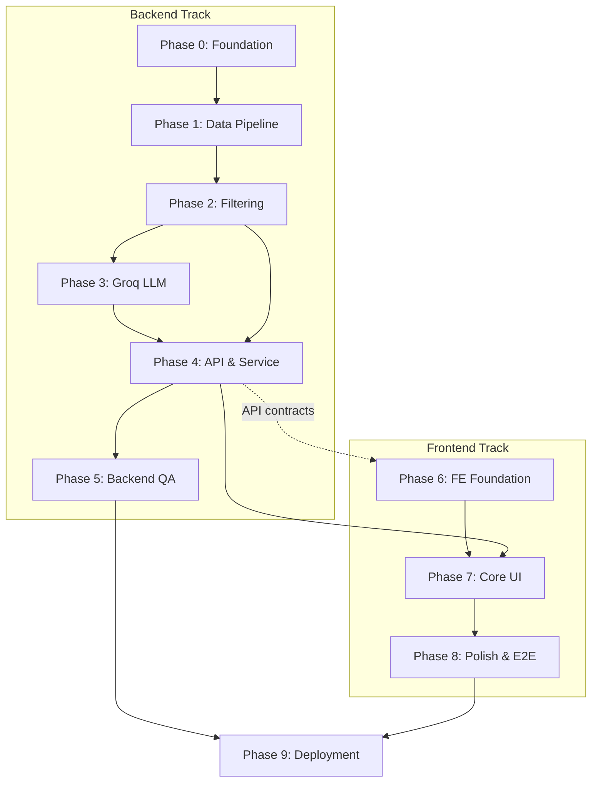

# Implementation Plan: AI-Powered Restaurant Recommendation System

This document provides a **phase-wise implementation plan** for building the Zomato-inspired restaurant recommendation service. It is derived from [context.md](context.md) (requirements and workflow) and [architecture.md](architecture.md) (technical design, components, and stack).

The plan is split into two tracks:

- **Backend track** (Phases 0–5) — data pipeline, filtering, Groq LLM, REST API
- **Frontend track** (Phases 6–8) — production-quality React UI
- **Deployment** (Phase 9, optional) — full-stack packaging and hosting

---

## Table of Contents

1. [Overview](#1-overview)
2. [Phase Summary](#2-phase-summary)
3. [Backend Track](#backend-track)
   - [Phase 0: Project Foundation](#phase-0-project-foundation)
   - [Phase 1: Data Ingestion & Preprocessing](#phase-1-data-ingestion--preprocessing)
   - [Phase 2: Domain Models & Preference Filtering](#phase-2-domain-models--preference-filtering)
   - [Phase 3: Groq LLM Integration](#phase-3-groq-llm-integration)
   - [Phase 4: Recommendation Service & API](#phase-4-recommendation-service--api)
   - [Phase 5: Backend Testing & Hardening](#phase-5-backend-testing--hardening)
4. [Frontend Track](#frontend-track)
   - [Phase 6: Frontend Foundation & Design System](#phase-6-frontend-foundation--design-system)
   - [Phase 7: Core Application UI](#phase-7-core-application-ui)
   - [Phase 8: Polish, Accessibility & E2E](#phase-8-polish-accessibility--e2e)
5. [Phase 9: Deployment (Optional)](#phase-9-deployment-optional)
6. [Dependency Graph](#dependency-graph)
7. [Risk Register](#risk-register)
8. [Definition of Done](#definition-of-done)

---

## 1. Overview

### Goals (from context)

| Goal | Phase(s) |
|------|----------|
| Load and preprocess Zomato dataset from Hugging Face | Backend 1 |
| Filter restaurants by structured criteria | Backend 2 |
| Rank and explain via Groq LLM | Backend 3, 4 |
| Expose REST API for recommendations and metadata | Backend 4 |
| Collect user preferences via a polished UI | Frontend 6, 7 |
| Display recommendations in a user-friendly format | Frontend 7, 8 |

### Tech Stack

| Layer | Choice | Track |
|-------|--------|-------|
| Language (backend) | Python 3.11+ | Backend |
| Data | `pandas`, `datasets` | Backend |
| API | FastAPI | Backend |
| LLM | Groq (`groq` SDK, `llama-3.3-70b-versatile`) | Backend |
| Config | `pydantic-settings`, `.env` | Backend |
| Testing (backend) | `pytest`, `httpx` | Backend |
| Language (frontend) | TypeScript | Frontend |
| Framework | React 18 + Vite | Frontend |
| Styling | Tailwind CSS + shadcn/ui | Frontend |
| Data fetching | TanStack Query (React Query) | Frontend |
| Forms & validation | React Hook Form + Zod | Frontend |
| Icons | Lucide React | Frontend |
| Testing (frontend) | Vitest + React Testing Library | Frontend |
| E2E | Playwright (optional) | Frontend |

### Estimated Timeline

| Phase | Track | Duration | Cumulative |
|-------|-------|----------|------------|
| 0 | Backend | 1–2 days | ~2 days |
| 1 | Backend | 2–3 days | ~5 days |
| 2 | Backend | 2–3 days | ~8 days |
| 3 | Backend | 2–3 days | ~11 days |
| 4 | Backend | 2–3 days | ~14 days |
| 5 | Backend | 2–3 days | ~17 days |
| 6 | Frontend | 2–3 days | ~20 days |
| 7 | Frontend | 3–5 days | ~25 days |
| 8 | Frontend | 2–4 days | ~29 days |
| 9 | Shared | 1–2 days | ~31 days |

*Estimates assume a single developer working full-time. Frontend Phase 6 can start once Backend Phase 4 API contracts are stable (mock or real endpoints).*

---

## 2. Phase Summary

```mermaid
gantt
    title Implementation Phases
    dateFormat X
    axisFormat %s

    section Backend
    Phase 0 - Foundation       :b0, 0, 2
    Phase 1 - Data Pipeline    :b1, 2, 5
    Phase 2 - Filtering        :b2, 5, 8
    Phase 3 - Groq LLM         :b3, 8, 11
    Phase 4 - API & Service    :b4, 11, 14
    Phase 5 - Backend QA       :b5, 14, 17

    section Frontend
    Phase 6 - FE Foundation    :f6, 14, 20
    Phase 7 - Core UI          :f7, 20, 25
    Phase 8 - Polish & E2E     :f8, 25, 29

    section Deploy
    Phase 9 - Deployment       :d9, 29, 31
```



| Phase | Track | Name | Primary Deliverable |
|-------|-------|------|---------------------|
| 0 | Backend | Project Foundation | Runnable FastAPI skeleton, monorepo layout |
| 1 | Backend | Data Ingestion & Preprocessing | Cached `restaurants.parquet`, metadata indexes |
| 2 | Backend | Domain Models & Preference Filtering | `CandidateFilter`, `FallbackRanker` |
| 3 | Backend | Groq LLM Integration | `GroqLLMClient`, prompts, response parser |
| 4 | Backend | Recommendation Service & API | `POST /recommend`, metadata endpoints |
| 5 | Backend | Backend Testing & Hardening | API test suite, logging, README (API) |
| 6 | Frontend | Foundation & Design System | React + Vite app, theme, API client |
| 7 | Frontend | Core Application UI | Preference form, recommendation results |
| 8 | Frontend | Polish, Accessibility & E2E | Responsive UX, a11y, full-stack demo |
| 9 | Shared | Deployment (Optional) | Docker, docker-compose, hosted demo |

---

# Backend Track

Phases 0–5 deliver the complete server-side pipeline: data → filter → LLM → REST API.

---

## Phase 0: Project Foundation

**Maps to:** Architecture §10 (Technology Stack), §10.2 (Project Structure)

**Duration:** 1–2 days

### Objectives

- Establish repository structure, dependencies, and configuration patterns before feature work.
- Reserve `frontend/` directory for the React app (Phase 6).

### Tasks

| # | Task | Files / Artifacts |
|---|------|-------------------|
| 0.1 | Create project directory structure per architecture | `app/`, `tests/`, `data/processed/`, `frontend/` (placeholder) |
| 0.2 | Add `requirements.txt` with core deps | `fastapi`, `uvicorn`, `pandas`, `datasets`, `groq`, `pydantic-settings`, `pytest` |
| 0.3 | Create `.env.example` with Groq and app settings | `GROQ_API_KEY`, `GROQ_MODEL`, etc. |
| 0.4 | Implement `app/core/config.py` using `pydantic-settings` | Load env vars with defaults |
| 0.5 | Add `app/core/exceptions.py` for domain errors | `NoCandidatesError`, `LLMError`, etc. |
| 0.6 | Scaffold FastAPI app with health endpoint | `app/main.py`, `GET /health` |
| 0.7 | Add `.gitignore` (`.env`, `data/`, `__pycache__`, `frontend/node_modules/`, etc.) | — |
| 0.8 | Verify local run: `uvicorn app.main:app --reload` | Health returns 200 |

### Deliverables

- [ ] Runnable FastAPI skeleton
- [ ] Configuration module with Groq settings
- [ ] `requirements.txt` and `.env.example`

### Acceptance Criteria

- `GET /health` returns `{"status": "ok"}`
- App starts without `GROQ_API_KEY` (key required only in Phase 3+)
- Project structure matches architecture §10.2

---

## Phase 1: Data Ingestion & Preprocessing

**Maps to:** Context §1 (Data Ingestion), Architecture §4 (Data Architecture), §6.1 (Data Ingestion Module)

**Duration:** 2–3 days

**Depends on:** Phase 0

### Objectives

- Load the Hugging Face dataset, preprocess it, cache locally, and expose metadata for downstream filtering and UI.

### Tasks

| # | Task | Details |
|---|------|---------|
| 1.1 | Implement dataset loader | `app/services/data_loader.py` — `datasets.load_dataset("ManikaSaini/zomato-restaurant-recommendation")` |
| 1.2 | Build preprocessor | `app/data/preprocessor.py` |
| 1.2a | Parse `rate` → float (strip `/5`) | Handle missing/invalid values |
| 1.2b | Parse `approx_cost(for two people)` → int | Handle ranges and non-numeric |
| 1.2c | Derive `budget_band` | low ≤ ₹300, medium ₹301–600, high > ₹600 |
| 1.2d | Split `cuisines` into normalized list | Lowercase, trim, comma-split |
| 1.2e | Set `city` to Bangalore | `listed_in(city)` holds neighbourhoods, not city |
| 1.2f | Parse `online_order`, `book_table` → bool | Yes/No |
| 1.2g | Assign stable `restaurant_id` | Hash of name+address |
| 1.2h | Drop duplicates and invalid rows | |
| 1.3 | Define `Restaurant` Pydantic model | `app/models/restaurant.py` per architecture §4.4 |
| 1.4 | Implement `RestaurantStore` | In-memory wrapper over processed DataFrame |
| 1.5 | Cache processed data | Write `data/processed/restaurants.parquet` on first run |
| 1.6 | Build metadata indexes | Unique locations, cuisines, budget band definitions |
| 1.7 | Wire data load on app startup | FastAPI lifespan or dependency injection |
| 1.8 | Add exploratory script or notebook (optional) | Validate row counts, sample records |

### Deliverables

- [ ] `preprocessor.py` with documented cleaning rules
- [ ] `Restaurant` model and `RestaurantStore`
- [ ] Cached parquet (~12k unique restaurants after dedup)
- [ ] `get_locations()`, `get_cuisines()` functions

### Acceptance Criteria

- Dataset loads from Hugging Face on first run; subsequent runs use cache
- ≥ 90% of rows have valid cost after preprocessing (rating may be lower due to dataset quality)
- Metadata lists return non-empty locations and cuisines
- All restaurants have `city = "Bangalore"`; `location` holds neighbourhood
- Sample restaurant record matches internal `Restaurant` schema

### Verification Commands

```bash
python -c "from app.services.data_loader import DataLoader; d=DataLoader(); df=d.load(); print(len(df), df.columns.tolist())"
```

---

## Phase 2: Domain Models & Preference Filtering

**Maps to:** Context §2 (User Input), §3 (Integration Layer — filter step), Architecture §5.2 (Filtering Logic), §6.2 (Preference Filter)

**Duration:** 2–3 days

**Depends on:** Phase 1

### Objectives

- Define user preference models and implement deterministic filtering to produce a bounded candidate set for the LLM.

### Tasks

| # | Task | Details |
|---|------|---------|
| 2.1 | Define `UserPreferences` model | `app/models/preferences.py` — location, budget, cuisine, min_rating, additional_preferences, top_n |
| 2.2 | Implement `CandidateFilter` | `app/services/filter.py` |
| 2.2a | Location filter | Match `location` or `city` (case-insensitive) |
| 2.2b | Cuisine filter | Substring match in cuisines list |
| 2.2c | Min rating filter | `rating >= min_rating` |
| 2.2d | Budget filter | Match `budget_band` |
| 2.2e | Optional filters | `online_order`, `book_table`, keyword match on `rest_type` / `meal_type` |
| 2.2f | Candidate cap | Pre-rank by `(rating, votes)`, return top 30 |
| 2.3 | Implement `FallbackRanker` | `app/services/fallback_ranker.py` — sort by rating, then votes |
| 2.4 | Add filter unit tests | `tests/test_filter.py` — known inputs → expected counts |
| 2.5 | Add fallback ranker tests | `tests/test_fallback_ranker.py` |
| 2.6 | CLI smoke test script (optional) | `scripts/smoke_filter.py` |

### Deliverables

- [ ] `UserPreferences` Pydantic model with validation
- [ ] `CandidateFilter` service
- [ ] `FallbackRanker` service
- [ ] Unit tests for filter and fallback

### Acceptance Criteria

- Filter returns empty list when no match (not an error at this layer)
- Filter returns ≤ 30 candidates when many match
- Known query (e.g. Koramangala + Italian + medium + rating ≥ 4) returns sensible candidates
- All tests pass: `pytest tests/test_filter.py tests/test_fallback_ranker.py`

---

## Phase 3: Groq LLM Integration

**Maps to:** Context §4 (Recommendation Engine), Architecture §7 (LLM Integration)

**Duration:** 2–3 days

**Depends on:** Phase 2

### Objectives

- Integrate Groq for ranking, explanations, and summary generation over a pre-filtered candidate list.

### Tasks

| # | Task | Details |
|---|------|---------|
| 3.1 | Implement `GroqLLMClient` | `app/llm/groq_client.py` — wrap `groq` SDK |
| 3.2 | Define system prompt | `app/llm/prompts.py` — role, constraints, JSON schema |
| 3.3 | Define user prompt template | Serialize preferences + numbered candidate list |
| 3.4 | Implement `PromptBuilder` | `app/services/prompt_builder.py` |
| 3.4a | Truncate `dish_liked` to 100 chars | Token budget management |
| 3.4b | Compact candidate serialization | id, name, cuisines, rating, cost, rest_type |
| 3.5 | Implement response parser | `app/llm/parser.py` |
| 3.5a | Parse JSON from Groq response | |
| 3.5b | Validate `restaurant_id` against candidates | Reject hallucinations |
| 3.5c | Retry once with repair prompt on parse failure | |
| 3.6 | Configure Groq settings | `response_format={"type": "json_object"}`, temperature 0.3 |
| 3.7 | Add integration test with mock Groq | `tests/test_parser.py` |
| 3.8 | Document prompt in `prompts.py` | Comment design rationale |

### Deliverables

- [ ] `GroqLLMClient` with timeout and error handling
- [ ] `PromptBuilder` and prompt templates
- [ ] `ResponseParser` with validation
- [ ] Manual test script: `scripts/test_groq_recommendation.py`

### Acceptance Criteria

- Groq returns valid JSON matching expected schema (summary + recommendations array)
- Every `restaurant_id` in response exists in the input candidate set
- No hallucinated restaurant names in validated output
- Parser handles malformed JSON with one retry
- `GROQ_API_KEY` required; missing key raises clear error

### Verification

```bash
# With GROQ_API_KEY set in .env
python scripts/test_groq_recommendation.py
```

---

## Phase 4: Recommendation Service & API

**Maps to:** Context §3–4 (Integration + Recommendation Engine), Architecture §6.3, §8 (API Design), §9 (Data Models)

**Duration:** 2–3 days

**Depends on:** Phase 2, Phase 3

### Objectives

- Orchestrate filter → prompt → Groq → parse into a single service and expose REST endpoints.
- Provide stable API contracts for the frontend (Phase 6+).

### Tasks

| # | Task | Details |
|---|------|---------|
| 4.1 | Define response models | `app/models/recommendation.py` — `Recommendation`, `RecommendationResponse`, `ResponseMeta` |
| 4.2 | Implement `RecommendationService` | `app/services/recommendation.py` |
| 4.2a | Call `CandidateFilter` | |
| 4.2b | If empty → raise `NoCandidatesError` | |
| 4.2c | Call `PromptBuilder` + `GroqLLMClient` | |
| 4.2d | Parse and merge with full `Restaurant` records | |
| 4.2e | On LLM failure → `FallbackRanker` with `meta.source="fallback"` | |
| 4.3 | Implement metadata routes | `app/api/routes/metadata.py` |
| 4.3a | `GET /metadata/locations` | |
| 4.3b | `GET /metadata/cuisines` | |
| 4.3c | `GET /metadata/budget-bands` | |
| 4.4 | Implement recommend route | `app/api/routes/recommend.py` — `POST /recommend` |
| 4.5 | Add dependency injection | `app/api/dependencies.py` — store, services |
| 4.6 | Map exceptions to HTTP status | 400, 404, 503 per architecture §8.2 |
| 4.7 | Enable CORS for frontend origin | `http://localhost:5173` in dev |
| 4.8 | Enable OpenAPI docs | Auto via FastAPI at `/docs` |
| 4.9 | Add API integration tests | `tests/test_api.py` |
| 4.10 | Export OpenAPI spec (optional) | `frontend` TypeScript types via openapi-typescript |

### Deliverables

- [ ] `RecommendationService` orchestrator
- [ ] All API endpoints from architecture §8.1
- [ ] Pydantic request/response models
- [ ] CORS configured for local frontend dev
- [ ] API integration tests

### Acceptance Criteria

- `POST /recommend` with valid body returns ranked recommendations with explanations
- Response includes `meta.candidates_considered`, `meta.source`, `meta.model`
- `404` when no restaurants match filters
- `400` when required fields missing or invalid budget
- Fallback path works when Groq is unavailable (mock or disable key)
- OpenAPI docs accessible at `/docs`

### Sample Request

```bash
curl -X POST http://localhost:8000/recommend \
  -H "Content-Type: application/json" \
  -d '{
    "location": "Koramangala",
    "budget": "medium",
    "cuisine": "Italian",
    "min_rating": 4.0,
    "additional_preferences": "family-friendly",
    "top_n": 5
  }'
```

---

## Phase 5: Backend Testing & Hardening

**Maps to:** Architecture §12 (NFRs), §13 (Security)

**Duration:** 2–3 days

**Depends on:** Phase 4

### Objectives

- Harden the API layer, expand test coverage, and document backend setup before frontend integration.

### Tasks

| # | Task | Details |
|---|------|---------|
| 5.1 | Expand unit test coverage | Preprocessor, filter, parser, fallback |
| 5.2 | API integration tests | All endpoints, error cases |
| 5.3 | Pipeline smoke test | `tests/test_e2e.py` or `scripts/` full backend path |
| 5.4 | Input validation hardening | Max length on `additional_preferences` (500 chars) |
| 5.5 | Security checklist | No API keys in logs; `.env` not committed; secrets only in `.env` |
| 5.6 | Add structured logging | Request ID, latency, candidate count, Groq errors |
| 5.7 | Write backend README section | Setup, env vars, run API, run tests |
| 5.8 | Finalize `.env.example` | Placeholder values only — no real secrets |
| 5.9 | Validate backend against context workflow | Steps 1, 3, 4 via API |

### Test Matrix

| Component | Test Type | File |
|-----------|-----------|------|
| Preprocessor | Unit | `tests/test_preprocessor.py` |
| CandidateFilter | Unit | `tests/test_filter.py` |
| FallbackRanker | Unit | `tests/test_fallback_ranker.py` |
| ResponseParser | Unit | `tests/test_parser.py` |
| API routes | Integration | `tests/test_api.py` |
| Full pipeline | E2E / smoke | `tests/test_e2e.py` |

### Deliverables

- [ ] Backend test suite with meaningful coverage
- [ ] Structured logging in place
- [ ] API documented in README
- [ ] `.env.example` with placeholders only

### Acceptance Criteria

- `pytest` passes all backend tests
- README enables API-only setup in < 15 minutes
- Full recommendation flow demonstrable via `curl` or `/docs`
- No secrets in repository

---

# Frontend Track

Phases 6–8 deliver a **production-quality React UI** — not a Streamlit prototype. The frontend is a separate Vite app in `frontend/` that consumes the FastAPI backend.

### Frontend quality bar

| Area | Target |
|------|--------|
| Visual design | Zomato-inspired: clean cards, red accent, readable typography, generous whitespace |
| Responsiveness | Mobile-first; works on phone, tablet, and desktop |
| UX | Clear form labels, inline validation, loading skeletons, helpful empty/error states |
| Performance | Fast first paint; debounced autocomplete; optimistic UI where safe |
| Accessibility | WCAG 2.1 AA basics: focus states, ARIA labels, keyboard navigation |
| Code quality | TypeScript strict mode, component composition, shared design tokens |

### Recommended `frontend/` structure

```
frontend/
├── index.html
├── package.json
├── vite.config.ts
├── tailwind.config.ts
├── tsconfig.json
├── src/
│   ├── main.tsx
│   ├── App.tsx
│   ├── api/
│   │   ├── client.ts          # fetch wrapper, base URL
│   │   └── types.ts           # generated or hand-written API types
│   ├── components/
│   │   ├── ui/                # shadcn primitives (Button, Card, Select, etc.)
│   │   ├── layout/            # Header, Footer, PageShell
│   │   ├── preferences/       # PreferenceForm, LocationSelect, RatingSlider
│   │   └── recommendations/   # RecommendationCard, ResultsList, SummaryBanner
│   ├── hooks/
│   │   ├── useMetadata.ts
│   │   └── useRecommendations.ts
│   ├── lib/
│   │   └── utils.ts
│   └── styles/
│       └── globals.css
└── public/
```

---

## Phase 6: Frontend Foundation & Design System

**Maps to:** Architecture §6.4 (Presentation Layer), Context §2 (User Input — UI shell)

**Duration:** 2–3 days

**Depends on:** Phase 4 (API contracts stable; can use mocks until Phase 4 is done)

### Objectives

- Scaffold the React + Vite + TypeScript app with Tailwind and a component library.
- Establish design tokens, layout shell, and typed API client.

### Tasks

| # | Task | Details |
|---|------|---------|
| 6.1 | Scaffold Vite + React + TypeScript | `npm create vite@latest frontend -- --template react-ts` |
| 6.2 | Add Tailwind CSS | Configure `tailwind.config.ts`, `globals.css` |
| 6.3 | Add shadcn/ui | Button, Card, Input, Select, Slider, Badge, Skeleton, Toast |
| 6.4 | Define design tokens | Colors (primary red `#E23744`), fonts, spacing, border radius |
| 6.5 | Build layout shell | Header with app name, hero section, responsive container |
| 6.6 | Implement API client | `src/api/client.ts` — base URL from `VITE_API_URL` |
| 6.7 | Add TanStack Query provider | Query client, devtools in development |
| 6.8 | Define TypeScript types | Mirror `UserPreferences`, `RecommendationResponse` from OpenAPI |
| 6.9 | Add `useMetadata` hook | Fetch locations, cuisines, budget bands on mount |
| 6.10 | Configure Vite proxy (dev) | Proxy `/api` → `http://localhost:8000` or use env var |
| 6.11 | Add frontend README section | Install, run, env vars |

### Deliverables

- [ ] Runnable `frontend/` dev server (`npm run dev`)
- [ ] Design system primitives (shadcn/ui)
- [ ] Layout shell with branding
- [ ] Typed API client + metadata hooks

### Acceptance Criteria

- `npm run dev` starts without errors
- Metadata fetches from backend (or mock) and renders in dev shell
- Consistent visual theme across placeholder pages
- TypeScript compiles with strict mode

---

## Phase 7: Core Application UI

**Maps to:** Context §2 (User Input), §5 (Output Display), Architecture §6.4

**Duration:** 3–5 days

**Depends on:** Phase 6, Phase 4 (live API)

### Objectives

- Build the full user flow: preference form → API call → recommendation results.

### Tasks

| # | Task | Details |
|---|------|---------|
| 7.1 | Build `PreferenceForm` | React Hook Form + Zod schema matching API |
| 7.1a | Location combobox | Searchable select from `/metadata/locations`; group city vs neighbourhood |
| 7.1b | Budget selector | Radio cards: Low / Medium / High with ₹ hints |
| 7.1c | Cuisine combobox | Searchable autocomplete from `/metadata/cuisines` |
| 7.1d | Min rating slider | 0.0 – 5.0 with star preview |
| 7.1e | Additional preferences | Textarea, 500 char counter |
| 7.1f | Top N selector | Stepper or select (1–10) |
| 7.2 | Form validation & submit | Disable submit while loading; show field errors |
| 7.3 | `useRecommendations` mutation | `POST /recommend` via TanStack Query |
| 7.4 | Loading state | Skeleton cards while Groq processes |
| 7.5 | Results section | |
| 7.5a | `SummaryBanner` | AI summary paragraph at top |
| 7.5b | `RecommendationCard` | Rank badge, name, cuisines, rating stars, cost |
| 7.5c | Explanation block | AI-generated text per card |
| 7.5d | Zomato link | External link button when `url` present |
| 7.5e | Fallback badge | Show when `meta.source === "fallback"` |
| 7.6 | Empty state | Illustration + “Broaden your filters” suggestions |
| 7.7 | Error state | Toast + inline message for 400/404/500 |
| 7.8 | Component tests | Vitest + RTL for form and card rendering |

### Deliverables

- [ ] Complete preference form with metadata-driven inputs
- [ ] Recommendation results with all context output fields
- [ ] Loading, empty, and error states
- [ ] Component tests for critical UI

### Acceptance Criteria

- User can select location, budget, cuisine, rating, and submit
- Top N recommendations render with name, cuisine, rating, cost, explanation
- Empty filter result shows helpful message with filter relaxation tips
- End-to-end flow works: form → API → Groq → displayed cards
- UI is usable on mobile (375px width)

### Context Output Mapping

| Context field | UI element |
|---------------|------------|
| Restaurant Name | Card title |
| Cuisine | Badge chips |
| Rating | Star rating + numeric `/5` |
| Estimated Cost | `₹{cost} for two` |
| AI-generated explanation | Card body text |
| Summary (optional) | `SummaryBanner` above results |

---

## Phase 8: Polish, Accessibility & E2E

**Maps to:** Architecture §12 (NFRs), Context §5 (Output Display — quality)

**Duration:** 2–4 days

**Depends on:** Phase 7

### Objectives

- Elevate the UI from functional to polished: animations, accessibility, responsive refinements, and full-stack validation.

### Tasks

| # | Task | Details |
|---|------|---------|
| 8.1 | Responsive refinements | Tablet/desktop multi-column card grid; sticky form on desktop |
| 8.2 | Micro-interactions | Card hover, submit button loading spinner, smooth scroll to results |
| 8.3 | Accessibility audit | Focus rings, `aria-label` on controls, colour contrast ≥ 4.5:1 |
| 8.4 | Keyboard navigation | Tab order, Enter to submit, Escape to close combobox |
| 8.5 | SEO & meta tags | Title, description, favicon |
| 8.6 | Error boundary | Graceful crash recovery |
| 8.7 | E2E tests (optional) | Playwright: happy path + empty results |
| 8.8 | Frontend README | Full setup, env vars, build for production |
| 8.9 | Full-stack smoke test | Backend + frontend running together |
| 8.10 | Context workflow validation | All 5 context steps via UI |

### Deliverables

- [ ] Polished, responsive UI
- [ ] Accessibility basics verified
- [ ] Production build (`npm run build`) succeeds
- [ ] Full-stack demo documented in README

### Acceptance Criteria

- UI looks professional and consistent with Zomato-inspired branding
- Lighthouse accessibility score ≥ 90 (local audit)
- `npm run build` produces deployable static assets
- Full context workflow demonstrable via browser

---

## Phase 9: Deployment (Optional)

**Maps to:** Architecture §11 (Deployment Architecture)

**Duration:** 1–2 days

**Depends on:** Phase 5, Phase 8

### Objectives

- Package and deploy backend API and frontend as a demo or production instance.

### Tasks

| # | Task | Details |
|---|------|---------|
| 9.1 | Add `Dockerfile` (backend) | Multi-stage: install deps, copy app, pre-bake parquet |
| 9.2 | Add `frontend/Dockerfile` | Build static assets with nginx |
| 9.3 | Add `docker-compose.yml` | API + frontend + optional nginx reverse proxy |
| 9.4 | Preprocess dataset at build time | Avoid HF download on every container start |
| 9.5 | Configure production env | `GROQ_API_KEY` via secrets manager; `VITE_API_URL` at build time |
| 9.6 | Add health checks | Backend `GET /health`; frontend nginx |
| 9.7 | Deploy to target platform | Railway, Fly.io, Render, Vercel (FE) + Railway (API) |
| 9.8 | Optional: rate limiting on `/recommend` | Per-IP limits |
| 9.9 | Deployment notes in README | One-command local docker-compose up |

### Deliverables

- [ ] Docker images build and run locally
- [ ] Deployed demo URL (if applicable)
- [ ] Deployment notes in README

### Acceptance Criteria

- `docker compose up` serves API and frontend
- `/recommend` works in deployed environment with Groq key configured
- Dataset available without re-downloading from Hugging Face on each request

---

## Dependency Graph



**Parallelization opportunities:**

- **Phase 6** can start once Phase 4 OpenAPI spec is stable (use mock API responses until backend is live)
- **Phase 5** backend tests can run in parallel with Phase 6 UI scaffolding
- **Phase 7** requires Phase 4 API running locally

---

## Risk Register

| Risk | Impact | Mitigation | Phase |
|------|--------|------------|-------|
| Hugging Face dataset download slow or fails | Blocks data pipeline | Cache parquet locally; document manual download fallback | B1 |
| Messy `rate` and `cost` fields | Incorrect filtering | Robust parsing with logging for unparseable rows | B1 |
| Groq API rate limits or outages | No AI recommendations | `FallbackRanker`; clear user message when on fallback | B3, B4 |
| LLM hallucinates restaurants | Wrong recommendations | Strict ID validation in parser; prompt constraints | B3 |
| Large prompt exceeds token limit | Groq errors | Cap candidates at 30; truncate long fields | B3 |
| Bangalore-only data vs Delhi in examples | User confusion | UI labels clarify available locations from metadata | F7 |
| `GROQ_API_KEY` leaked | Security incident | `.env` only; placeholders in `.env.example` | B0, B5 |
| CORS misconfiguration | Frontend cannot call API | Configure allowed origins in FastAPI middleware | B4 |
| Frontend/backend type drift | Runtime bugs | Generate TS types from OpenAPI spec | B4, F6 |
| Slow Groq response hurts UX | Poor perceived performance | Loading skeletons; show candidate count; fallback badge | F7 |

---

## Definition of Done

The project is **complete** when all of the following are true:

### Functional (from context)

- [ ] Zomato dataset loaded and preprocessed from Hugging Face
- [ ] User can specify location, budget, cuisine, min rating, and additional preferences
- [ ] System filters restaurants before LLM processing
- [ ] Groq LLM ranks restaurants and generates explanations
- [ ] Optional summary of recommendations is shown
- [ ] UI displays: name, cuisine, rating, cost, AI explanation

### Backend

- [ ] Layered architecture: Data → Integration → Application
- [ ] `POST /recommend` and metadata endpoints implemented
- [ ] Groq integration via `groq` SDK with structured JSON output
- [ ] Fallback ranking when Groq fails
- [ ] No hallucinated restaurants in validated responses
- [ ] `GROQ_API_KEY` managed via environment variables
- [ ] `pytest` passes all backend tests

### Frontend

- [ ] React + Vite + TypeScript app in `frontend/`
- [ ] Metadata-driven preference form
- [ ] Recommendation cards with all required output fields
- [ ] Loading, empty, and error states
- [ ] Responsive layout (mobile + desktop)
- [ ] Production build succeeds

### Quality

- [ ] README documents full-stack setup and usage
- [ ] `.env.example` complete with placeholders only
- [ ] End-to-end demo works locally (browser + API)
- [ ] No secrets in repository

---

## Appendix: Phase-to-Architecture Mapping

| Architecture component | Implementation phase |
|------------------------|----------------------|
| `DataLoader`, `Preprocessor` | Backend 1 |
| `RestaurantStore`, `Metadata Index` | Backend 1 |
| `UserPreferences`, `CandidateFilter` | Backend 2 |
| `FallbackRanker` | Backend 2 |
| `GroqLLMClient`, `PromptBuilder`, `ResponseParser` | Backend 3 |
| `RecommendationService` | Backend 4 |
| API routes (`/recommend`, `/metadata/*`) | Backend 4 |
| Tests, logging, API docs | Backend 5 |
| React app shell, design system, API client | Frontend 6 |
| Preference form, recommendation UI | Frontend 7 |
| Polish, a11y, E2E | Frontend 8 |
| Docker, deploy | Phase 9 |

---

## Appendix: Context Workflow Checklist

Use this checklist during Phase 8 to validate the full system against [context.md](context.md):

| # | Context step | Validation |
|---|--------------|------------|
| 1 | Data Ingestion | Parquet cache exists; fields extracted correctly |
| 2 | User Input | UI form collects all preference types |
| 3 | Integration Layer | Filter narrows candidates; prompt includes structured data |
| 4 | Recommendation Engine | Groq ranks, explains, and optionally summarizes |
| 5 | Output Display | All five output fields visible in UI |

---

*This plan aligns with [context.md](context.md) and [architecture.md](architecture.md). Update phase estimates and task status as implementation progresses.*
